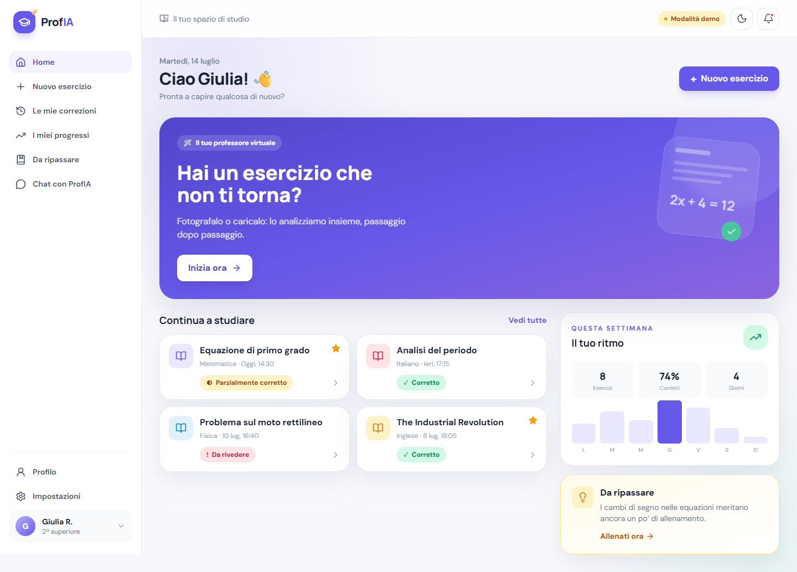
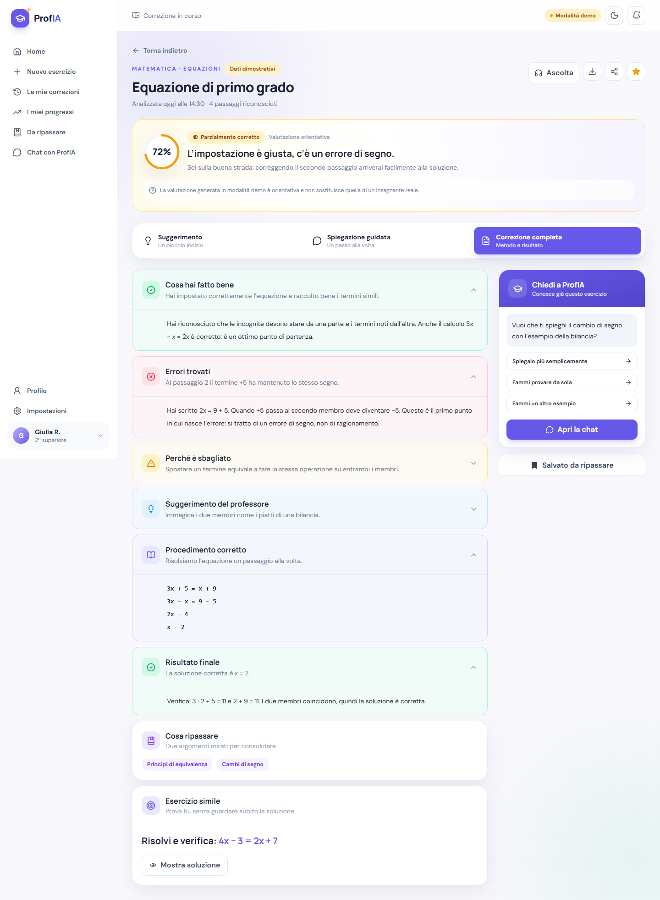

# ProfIA

**ProfIA** è un’applicazione didattica moderna e responsive che aiuta gli studenti a capire i propri esercizi, non soltanto a conoscere la risposta. Il prototipo include un flusso completo da foto/PDF a OCR verificabile, correzione guidata, chat contestuale e monitoraggio dei progressi.

> Stato: prototipo navigabile pronto per il collegamento a Supabase e a servizi OCR/AI. Senza variabili d’ambiente l’app usa dati dimostrativi chiaramente etichettati e non attribuisce le risposte a un modello reale.

## Anteprima

| Dashboard | Correzione |
| --- | --- |
|  |  |

È inclusa anche un’anteprima mobile in `docs/screenshots/mobile-dashboard.png`.

## Funzionalità

- Accesso via email/password, Google e modalità ospite, con fallback demo.
- Dashboard responsive con attività recenti, ritmo di studio e consigli mirati.
- Caricamento da fotocamera, galleria, drag-and-drop o PDF.
- Validazione locale di tipo e dimensione (JPG, PNG, WEBP, HEIC, PDF; massimo 12 MB).
- Anteprima con rotazione, luminosità, contrasto, ritaglio predisposto e consenso privacy.
- OCR separato in consegna, svolgimento, passaggi e annotazioni, sempre modificabile.
- Regola anti-invenzione per contenuti illeggibili o ambigui.
- Tre modalità: **Suggerimento**, **Spiegazione guidata**, **Correzione completa**.
- Correzione accessibile con icone, etichette e colori semantici; primo errore evidenziato.
- Sintesi vocale, stampa/esportazione PDF del browser e condivisione nativa.
- Chat che mantiene materia, livello e contesto dell’esercizio.
- Storico, preferiti, “Da ripassare”, grafici dei progressi e suggerimenti.
- Profilo adattivo e impostazioni per tema, notifiche, accessibilità e privacy.
- Privacy e Termini dedicati, cancellazione/esportazione dati predisposte.
- Modalità chiara/scura e layout per smartphone, tablet e desktop.

## Stack

- React 19 + TypeScript
- Vite 7
- Tailwind CSS 3
- React Router
- Lucide Icons
- Supabase Auth, PostgreSQL, Storage, Row Level Security ed Edge Functions
- Vitest + Testing Library
- ESLint + GitHub Actions

## Architettura

```text
src/
├── components/       navigazione e componenti condivisi
├── context/          stato demo, tema, profilo e preferiti
├── lib/              client Supabase e adapter API
├── pages/            accesso, studio, progressi e account
├── test/             setup Vitest
├── App.tsx           routing
└── index.css         design system Tailwind

supabase/
├── functions/
│   ├── analyze-exercise/   analisi AI protetta
│   ├── process-ocr/        OCR protetto
│   └── _shared/            HTTP/CORS condiviso
├── migrations/             schema, trigger, RLS e Storage
└── config.toml
```

Il browser usa soltanto la chiave anonima Supabase. OCR e AI vengono invocati dalle Edge Functions; `AI_API_KEY`, `OCR_API_KEY` e la service role non entrano mai nel bundle frontend.

## Requisiti

- Node.js 22 o successivo
- pnpm 10 o successivo
- account Supabase per le funzioni reali
- endpoint OCR e modello AI compatibile con l’adapter server incluso

## Avvio locale

```bash
git clone <URL_DEL_REPOSITORY>
cd ProfIA
pnpm install
cp .env.example .env
pnpm dev
```

Aprire `http://localhost:5173`. Senza configurazione Supabase, utilizzare **Entra come ospite** oppure le credenziali demo già compilate.

## Variabili d’ambiente

Copiare `.env.example` in `.env`. Il file `.env` è escluso da Git.

| Variabile | Ambiente | Scopo |
| --- | --- | --- |
| `VITE_SUPABASE_URL` | browser | URL del progetto Supabase |
| `VITE_SUPABASE_ANON_KEY` | browser | chiave anonima pubblicabile, protetta da RLS |
| `AI_API_KEY` | server secret | autenticazione del provider AI |
| `AI_MODEL` | server secret/config | modello multimodale scelto |
| `AI_API_URL` | server | endpoint AI compatibile |
| `OCR_API_KEY` | server secret | autenticazione OCR |
| `OCR_ENDPOINT` | server | endpoint OCR |
| `APP_ORIGIN` | server | origine autorizzata per CORS |
| `SUPABASE_SERVICE_ROLE_KEY` | server secret | operazioni privilegiate; mai usare nel browser |

Per le Edge Functions configurare i secret con il CLI Supabase o dalla dashboard, non in file versionati.

## Configurazione Supabase

1. Creare un progetto Supabase.
2. Applicare `supabase/migrations/001_initial_schema.sql` con Supabase CLI o SQL Editor.
3. Abilitare Google e Anonymous Sign-Ins, se desiderati.
4. Impostare URL sito e redirect consentiti per locale e produzione.
5. Distribuire le funzioni:

```bash
supabase functions deploy process-ocr
supabase functions deploy analyze-exercise
```

6. Aggiungere i secret server con `supabase secrets set ...`.

Lo schema crea profili, materie, esercizi, file, testi OCR, correzioni, messaggi, progressi, preferiti e argomenti da ripassare. Tutte le tabelle private hanno RLS e policy basate su `auth.uid()`. Il bucket `exercise-files` è privato e accetta solo MIME supportati entro 12 MB.

## Comandi

```bash
pnpm dev          # server di sviluppo
pnpm build        # typecheck + build di produzione
pnpm start        # anteprima della build
pnpm lint         # controllo ESLint
pnpm typecheck    # controllo TypeScript
pnpm test         # test una tantum
pnpm test:watch   # test in watch mode
```

## Test e qualità

Prima di aprire una pull request:

```bash
pnpm lint
pnpm typecheck
pnpm test
pnpm build
```

Il workflow `.github/workflows/ci.yml` esegue automaticamente gli stessi controlli su ogni push e pull request, senza secret inclusi nel repository.

## Pubblicazione

### Vercel

1. Importare il repository in Vercel.
2. Selezionare Vite; `vercel.json` contiene build, output e rewrite SPA.
3. Inserire soltanto le variabili frontend `VITE_*` nel progetto Vercel.
4. Mantenere i secret OCR/AI nelle Edge Functions Supabase.
5. Pubblicare e aggiungere il dominio agli URL autorizzati di Supabase Auth e a `APP_ORIGIN`.

### Netlify

Usare `pnpm build` e directory `dist`; aggiungere una rewrite SPA `/* /index.html 200` nella configurazione Netlify.

## Sicurezza e privacy

- Non committare mai `.env`, chiavi API, service role o token.
- Le chiavi `VITE_*` sono visibili nel browser: usare solo la chiave anonima Supabase con RLS.
- Verificare sempre JWT, proprietà dell’esercizio e MIME anche sul server.
- Applicare rate limiting, limiti di spesa e monitoraggio prima della produzione.
- Le URL dei file sono firmate e temporanee; il bucket non è pubblico.
- Nessun contenuto viene destinato all’addestramento senza consenso esplicito.
- L’utente può eliminare dati e account; definire tempi di conservazione reali prima del lancio.
- Informativa e Termini inclusi sono bozze di prodotto, non consulenza legale: completarli con titolare, contatti e normativa applicabile.

## Checklist prima del lancio

- Collegare davvero upload, ritaglio/redazione e persistenzа UI a Supabase.
- Adattare i parser di `process-ocr` e `analyze-exercise` al provider scelto.
- Aggiungere rate limiting, antivirus/scansione file e moderazione dei contenuti.
- Eseguire test end-to-end, audit accessibilità e test RLS con più utenti.
- Configurare osservabilità, backup, retention, controllo costi e procedura incidenti.
- Far revisionare i documenti legali, soprattutto per l’uso da parte di minori.

## Contribuire

1. Creare un branch descrittivo.
2. Fare modifiche piccole e testabili.
3. Eseguire tutti i controlli locali.
4. Aprire una pull request descrivendo comportamento, test e impatto privacy.

Per segnalazioni di sicurezza, non aprire issue pubbliche: usare il canale privato indicato dal gestore del repository.

## Licenza

Nessuna licenza è concessa automaticamente. Aggiungere una licenza esplicita prima della pubblicazione open source.
